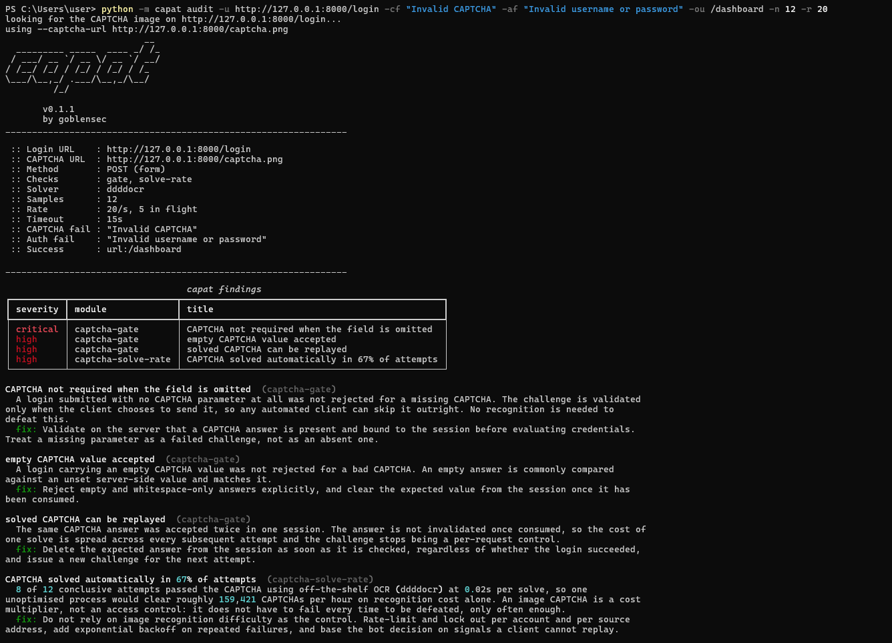
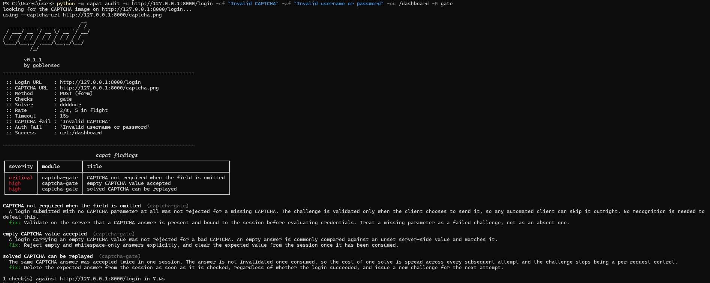
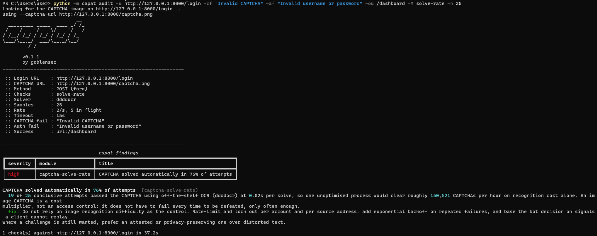
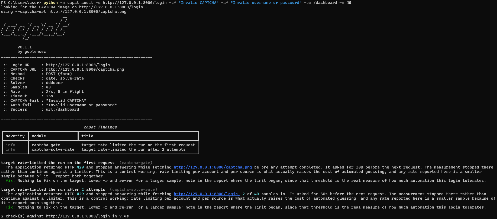
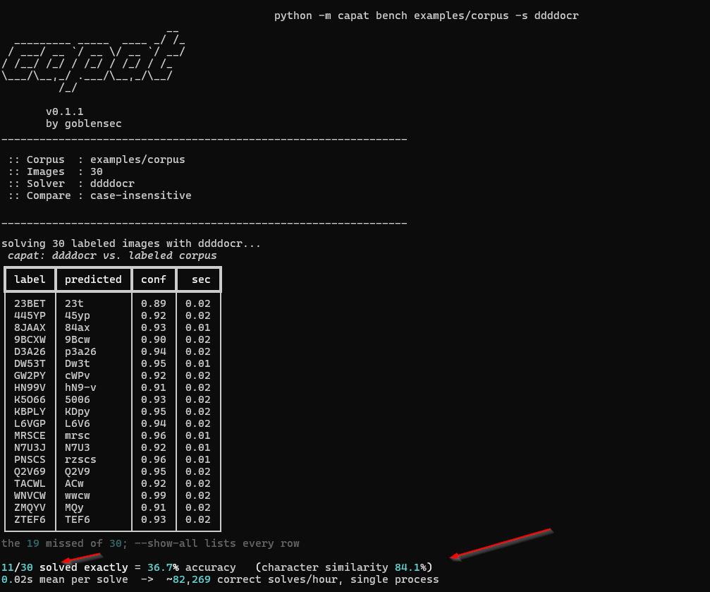
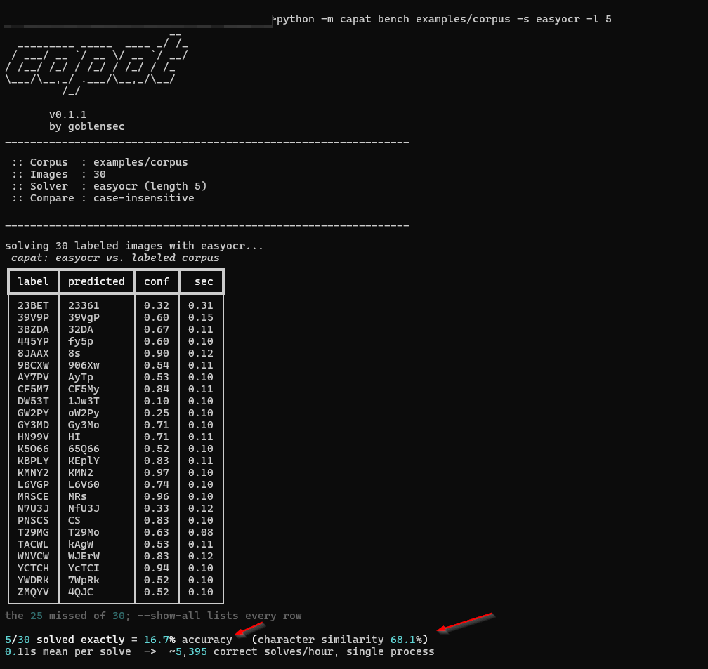
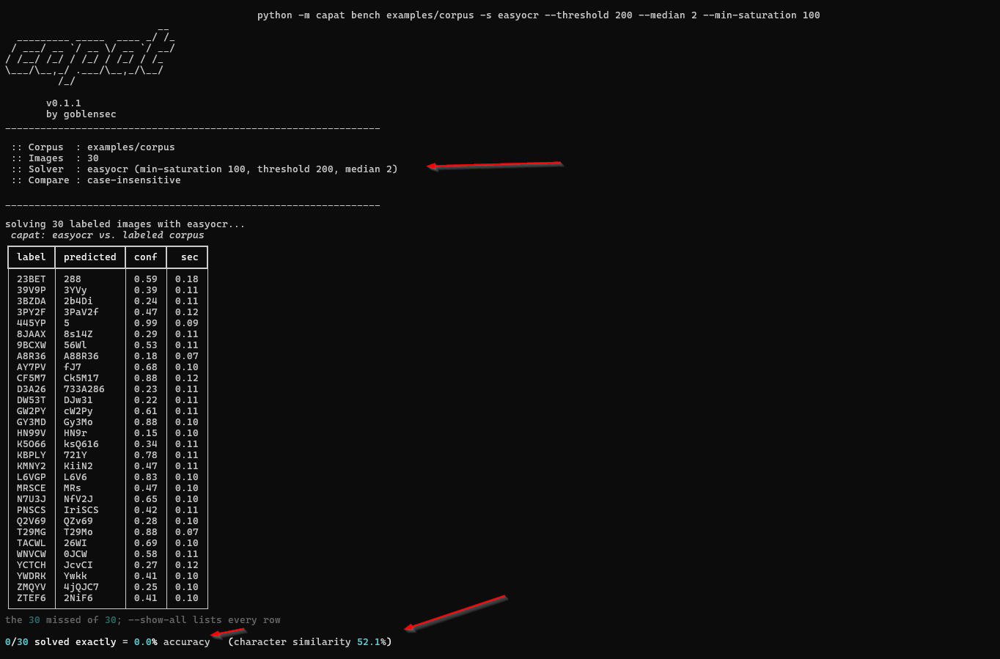
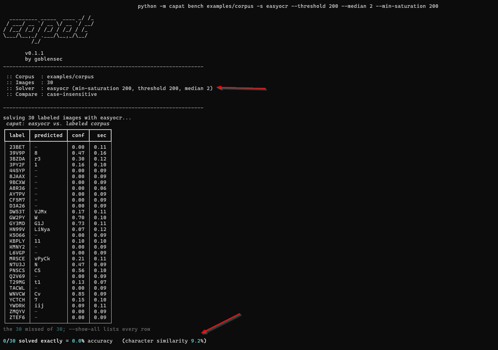
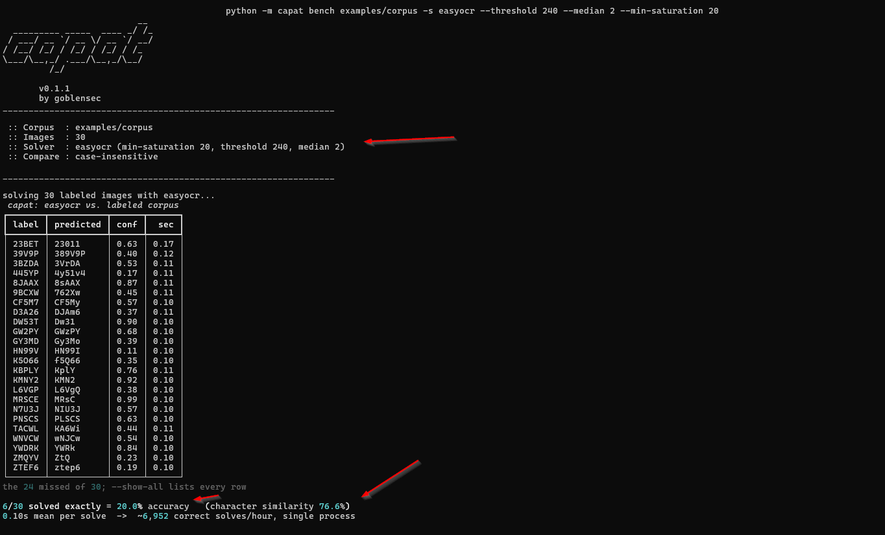
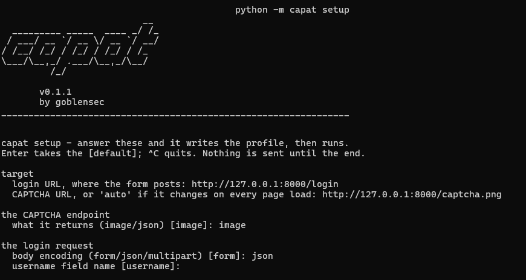

# Your CAPTCHA Is Not a Bot Control. Here Is How to Measure It.

*Every number below came out of a real run on 2026-09-14, against
`examples/demo_app.py` and the 30 labelled images in `examples/corpus`. Every
command is in here, so you can re-run the lot and see what you get instead of
taking my word for it. I'm just a guy with a terminal.*

---

I keep finding the same thing on client login pages. There's an image CAPTCHA
sitting in front of the password field, looking busy, doing absolutely nothing.

Not "not much". Nothing. Either a model reads it faster than you can blink, or
the app never checks the answer in the first place. Both are everywhere. What's
rare is anyone having actually checked which one they've got.

So I wrote a thing that checks. It's out today.

## Why these stopped working

The squiggly-letters CAPTCHA was invented back when software genuinely couldn't
read squiggly letters, which was a completely reasonable assumption at the time
and has not been true for years. A text-recognition model about 10 MB big, free,
downloads in a few seconds and reads distorted text on a normal laptop CPU. You
don't train it. You don't need a GPU. There's no API key and nobody to pay.

On my 30-image corpus, the stock engine got **11 of them exactly right (36.7%)**
and **84.1% of the characters**, with zero tuning, at **20 ms an image**. That's
roughly **82,000 tries an hour** out of one process on a laptop.

Now, 36.7% sounds low, and that's the trap. It means an attacker burns 2.7
attempts per password guess. That's the "cost" your CAPTCHA is imposing. Two
point seven. On a control that was supposed to make automation impossible.

And that's the *lazy* number - first command, no tuning, straight out of the box.
The number you should actually plan against is what someone gets after poking at
it for an afternoon, which is the rabbit hole further down.

If a stock model does struggle on your particular CAPTCHA, the move is to train
one on your particular CAPTCHA. That's not some elite thing. That's a weekend.

## Three questions, and only one is about OCR

A CAPTCHA either costs an attacker something or it doesn't. Three things decide
that:

**1. Can a machine read it?**
The solve rate. At 70% an attacker spends 1.4 tries per guess, which rounds to
"no obstacle" on any throughput that matters.

**2. Is anyone even checking the answer?**
This is the one that makes people sit up. Loads of apps only validate the CAPTCHA
if the browser bothers to send it. Drop the field entirely and you walk straight
in. Send it empty and it happily matches the empty thing sitting on the server.
Send yesterday's correct answer and it gets accepted again, and again, and again.
None of this needs OCR or a model or any of the clever stuff. It needs curl.

**3. So what *is* protecting this page?**
Usually rate limiting. Not the CAPTCHA. Worth knowing before you spend money on
the wrong one.

## The tool

`capat` - CAPtcha ATtacking Tool. Point it at a login page you're allowed to
test, and it answers all three.

```bash
pip install "capat[ddddocr]"
```


*One run against a deliberately broken demo app: three enforcement failures,
then the rate.*

Those two quoted phrases in the command are doing all the work. You're teaching
it to tell *wrong CAPTCHA* apart from *wrong password*. Without that it can't
tell a misread image from a rejected login, and every number after that point is
vibes.

## Enforcement first - no model required

Before you ask whether a machine can read the image, ask whether the image
matters at all. Three things, no recognition needed:

- send the login with the CAPTCHA field **missing**
- send it **empty**
- send an answer that **already worked once**


*The enforcement findings, with the reasoning and the fix printed under each
one.*

If any of those get through, stop. Don't measure the solve rate, don't tune
anything, don't buy a harder CAPTCHA. The image is wallpaper and the fix is in
the login handler, and it's usually about one line.

## Then the solve rate


*16 of 25 sampled challenges. 64%.*

Now hold on. The first screenshot in this post said 92% against the *same app*,
and I'm not going to quietly pretend you didn't notice.

That run sampled 12 challenges, this one sampled 25. The demo mints a fresh
answer and a fresh distortion every single request, so nothing about the target
changed. 11-of-12 and 16-of-25 just aren't a real difference - Fisher's exact
puts them at p = 0.12, and the 95% intervals (65-98% and 45-80%) overlap almost
completely. Pool them and the honest answer is **27 of 37, 73%, interval
57-85%**.

Which is why `-n` exists. A percentage out of twelve attempts is a headline, not
a measurement. If it's going in a report, sample until the interval is tight
enough to act on, and put the interval next to the number. I've handed clients
the bare percentage before. Don't do that.

This bit does submit real logins, so it's deliberately boring about safety: made
up username, fresh random password every attempt. It can't lock out a real
account and it can't accidentally log in as someone. Real passwords only get
tried if you hand it a wordlist yourself.

## When something actually works, say so

Most scanners only ever tell you what's broken, which makes them exhausting to
read and easy to dismiss, and it also means the one control that's genuinely
holding the line goes unmentioned. So when the app starts refusing requests,
capat stops and reports where the wall was, as a finding in its own right.


*A target that defends itself, and gets credit for it. The 30-second wait isn't
invented - that's the target's own `Retry-After` header. No header, no sentence;
it doesn't make one up on your behalf.*

## The part that took longest and nobody will notice

The classic failure mode for a tool like this is claiming more than the run
showed. I've spent more time on that than on the solving, honestly.

- An **unrecognised response is not a missing control.** If the app answers in
  wording the tool doesn't know, that's an inconclusive INFO. Not a CRITICAL.
- A **zero solve rate measures my engine, not your CAPTCHA.** It says so, and
  points at your solver settings instead of handing the defender a trophy.
- A **check that couldn't run is not a clean result.** If the replay test never
  managed to solve a challenge to replay, it says "couldn't test this". It does
  not say "no findings".
- A **password whose CAPTCHA got misread has not been tested.** It's retried,
  and anything still untested gets counted and named.

A tool that quietly says "all good" about a test it never ran is worse than no
tool, because now you've got a clean report to wave at someone. All four of those
are pinned by tests so they can't quietly come back.

## Bring your own model

The engines swap out, and the interesting case is a model trained on the exact
CAPTCHA in front of you - which, again, is what a motivated attacker has.

```bash
capat bench examples/corpus -s ddddocr
capat bench examples/corpus -s easyocr -l 5
```



*Same 30 images, two engines: ddddocr 36.7% exact and 84.1% character similarity
at 0.02s an image; easyocr 16.7% and 68.1%. The table only lists the misses,
which is why every row on screen is wrong - `--show-all` gives you the rest.*

## The rabbit hole: finding the recipe

Every image gets cleaned up before the engine ever sees it, and on a nasty
CAPTCHA that cleanup matters more than which engine you picked. There is no
magic default, because the right recipe is a property of *this* image. You can't
look it up. You have to go look at the thing.

It's the same loop as everything else in this job, so you already know how to run
it: look at the thing properly, guess, poke it, then read what fell out instead of
just reading the score.


So open one up and ask what actually separates the letters from the junk:

- **What's ink and what's noise?** Here: five coloured glyphs, thin grey wavy
  lines scribbled over them, white background.
- **What one property tells them apart?** Not brightness - the lines and the
  letters are about equally dark, so a brightness threshold just trades one for
  the other. Colour does it: the letters are saturated, the lines are grey.
  That's what `--min-saturation` is for, and on this corpus it's *the* knob.

  Worth a detour, because this is the bit I actually enjoyed: it converts to HSV
  and keeps pixels whose S channel is above your number, *before* anything gets
  turned grey. Order matters. Once you've flattened to greyscale the colour is
  gone and a grey noise line and a red letter stroke are the same pixel value -
  no threshold on earth separates them after that. Filter on colour while you
  still have colour.
- **How thick is the noise vs a stroke?** One pixel against several, so a small
  median filter wipes the lines and leaves the letters. Crank the kernel and it
  starts eating letters too.
- **How big is the image?** 170x54, which is tiny. Thresholding thins strokes and
  sometimes snaps them, so upscale first - `--scale` defaults to 3 for exactly
  that reason.

Here's where I went wrong, which is the useful bit. I'd worked out that
saturation was the thing that mattered, so I cranked it - high `--min-saturation`,
high threshold, be aggressive, throw away everything that isn't obviously a
letter. Sounds right. It was exactly backwards, and it took me three runs to
admit it.

Three runs, same 30 images, same engine.


*`--min-saturation 100 --threshold 200 --median 2`: 0 of 30, character
similarity 52.1%.*

Zero percent. Which looks like a dead end, and I nearly binned the whole recipe
on the strength of it.

Look at the `predicted` column instead of the headline. `23BET` came back as
`288`. `445YP` as `5`. `8JAAX` as `8s14Z`. Everything's *too short*. Short means
characters are being **erased**, not misread. Something in my recipe is deleting
ink before the engine even gets a look at it.

Two suspects: `--min-saturation 100` is chucking away every glyph that isn't
vividly coloured, and `--threshold 200` is turning anything lighter than that
into background.


*Same recipe, `--min-saturation 200`: 0 of 30, character similarity 9.2%.*

So I shoved the suspect knob further the *wrong* way on purpose, just to be sure
I'd understood it. 100 to 200. Most rows come back completely empty at
`conf 0.00`, which is easyocr politely telling me there is nothing in the image.
I had very successfully deleted the CAPTCHA.

And this is the most useful run of the three, despite being comfortably the
worst. Both runs scored exactly 0%, so the headline number couldn't tell them
apart at all - but character similarity fell 52.1% → 9.2%. **When accuracy is
pinned at zero, steer by the similarity figure.** It still moves. It's the only
compass you've got down there.


*`--min-saturation 20 --threshold 240 --median 2`: 6 of 30 = 20.0%, character
similarity 76.6%, ~6,950 solves an hour.*

So: reverse. Only throw out the properly grey pixels, and raise the threshold so
faint ink survives instead of getting flattened. (Two knobs at once, which breaks
my own rule below - both suspects pointed the same way, so treat this run as
confirming the diagnosis, not as proof of which knob earned the points.)

The number went up, fine. But the *far* more interesting thing is that **the
failure changed shape**. `23BET` is now `23011`. `39V9P` is `389V9P`. `CF5M7` is
`CF5My`. Full length now, and wrong in a completely different way - these are
letter-for-letter mix-ups, not gaps.

Nothing's being erased any more. The engine is just confusing characters. That's
a completely different problem, and telling those two apart is basically the
whole skill:

- **Ink is being erased** - short or blank predictions, low confidence. That's
  yours to fix. Keep tuning.
- **Characters are being confused** - full length, decent confidence, wrong
  letters. That is *not* a flags problem. More filtering buys you a point at a
  time while you burn an afternoon. What buys the rest is a different engine, or
  a model trained on this exact font.

Three rules to stop yourself lying to yourself:

1. **One knob per run.** The banner prints the recipe it measured with, so every
   screenshot up there is reproducible from the picture alone. That was a bug I
   fixed for this exact reason - two runs once printed identical banners and
   different accuracies, which is the tool gaslighting you.
2. **30 images is a small corpus.** 5-of-30 vs 6-of-30 is *one image*, not a
   discovery. Move when several images move, or go grow the corpus with
   `capat collect`.
3. **Do all of this offline first.** A labelled corpus costs zero requests, runs
   the same every time, and can't lock anybody out of anything. Tune here, then
   go near the live target.

And keep it in proportion: everything above is the *weaker* engine getting
dragged from 16.7% to 20% by a few minutes of guessing. ddddocr read the same
corpus at 36.7% cold, in a fifth of the time. An attacker starts where I
finished. That's why the number a defender should worry about is never the one
from your first run.

A custom network is a file path, not a plugin: `-s model.onnx`, charset sidecar
next to it. I'm working on a companion project for training one.

## If you don't want to learn twenty flags

```bash
capat setup
```

It asks you for the URLs, the field names and the two phrases, writes a profile,
shows you the command it built, and runs it.


*The wizard, asking for what it needs.*

## Grab it

```bash
pip install "capat[ddddocr]"
capat audit -u https://your-site/login -cf "invalid captcha" -af "invalid username or password"
```

Source, full guide, every flag: **https://github.com/goblensec/capat**

MIT. Issues and PRs welcome.

## One serious note, and I do mean serious

capat sends real login attempts at a live application. Point it at your own
systems, or ones you have written permission to test. Anywhere else, this is
probably a crime where you live, and the defaults will not save you.

---

*If you run it against your own login page, tell me the number you got. That's
the entire point of the thing.*
